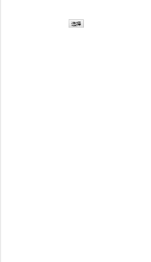

# vue-district-picker



## install

npm install --save vue-district-picker

## Use

导入省市区数据，默认在dist/area.json
引入样式，默认在 dist/vue-district-picker.css
```
import VueDistrictPicer from 'vue-district-picker';
import 'vue-district-picker/dist/vue-district-picker.css'

Vue.use(VueDistrictPicer)

<vue-district-picker :show.sync="show" @confirm="confirm" :citydata="citydata"></vue-district-picker>
```


## props

```
{
    // 省市区数据
    citydata: {
      type: Object
    },
    // 双向绑定显示隐藏
    show: {
      type: Boolean,
      default: false
    },
    zIndex: [Number],

    //初始化数据（对应省市区数据ID）
    areaData: {
      type: Array,
      default: () => {
        return ["340000", "340100", "340103"]
      }
}
```

## 鸣谢

[AlloyTouch](https://github.com/AlloyTeam/AlloyTouch)


